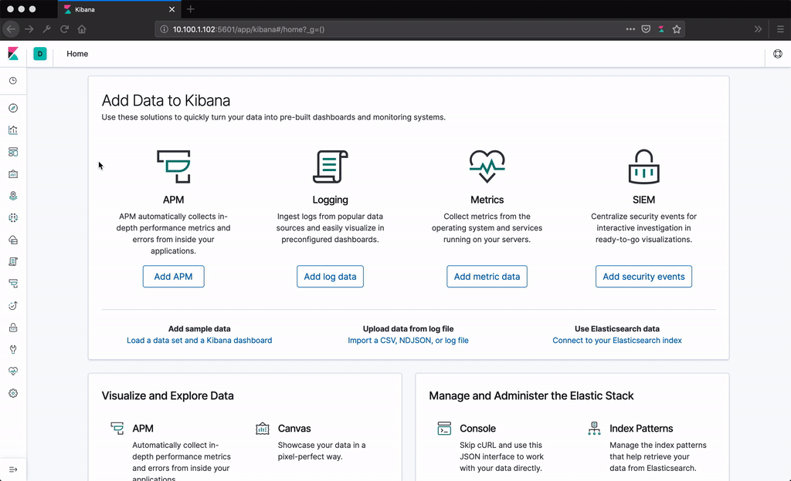

# MySQL Query Analyzer



## Installation

### Clone Repository

```sh
git clone https://github.com/brunowego/playing-with.git playing-with && cd "$_"
```

```sh
cd ./analytics/mysql-query-analyzer
```

### Boot Compose

```sh
make compose/up
```

```sh
make compose/status
```

#### Show Logs

```sh
make mysql/logs
```

## Setup

### Seed Database

```sh
make db/seed
```

### Show Elasticsearch Indices

```sh
curl 'http://127.0.0.1:9200/_cat/indices?v'
```

### Create Dashboards

```sh
make filebeat/setup
```

## Database

### Run a Query

```sh
make db/query
```

```sh
make mysql/logs
```

### Kibana Dashboard

```sh
xdg-open 'http://127.0.0.1:5601' || open 'http://127.0.0.1:5601' || echo -e '[INFO]\thttp://127.0.0.1:5601'
```

1. Main Menu: Dashboards
2. Search: [Filebeat MySQL] Overview ECS

## Shutdown

```sh
make compose/down
```
