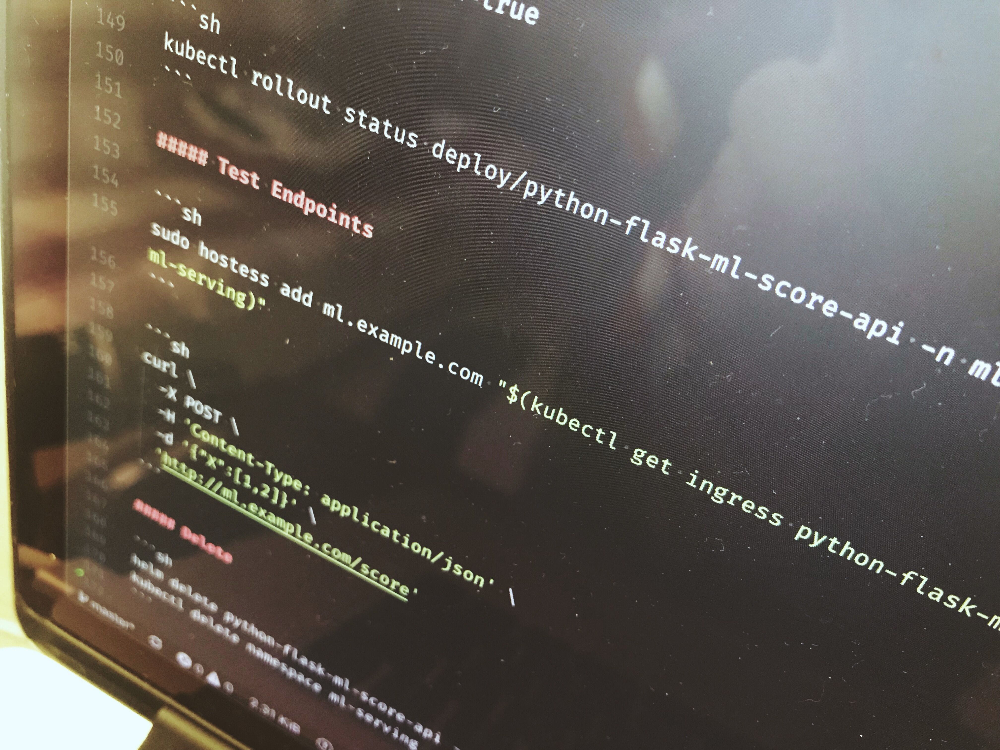

# Python Flask ML Score API



## Installation

### Clone Repository

```sh
git clone https://github.com/brunowego/playing-with.git playing-with && cd "$_"
```

```sh
cd ./mlops/python-flask-ml-score-api
```

### Options

- [Local Environment](#local-environment)
- [With Docker](#with-docker)
- [Witch Kubernetes using manifest files](#using-manifest-files)
- [Witch Kubernetes using Helm Chart](#using-helm-chart)

## Running

### Local Environment

#### Install Dependencies

```sh
make dev/install
```

#### Start

```sh
make dev/run
```

#### Test Endpoints

```sh
make dev/status
```

```sh
curl \
  -X POST \
  -H 'Content-Type: application/json' \
  -d '{"X":[1,2]}' \
  'http://127.0.0.1:5000/score'
```

#### Stop

```sh
make dev/stop
```

#### Remove

```sh
make dev/remove
```

### With Docker

#### Build

```sh
make docker/build
```

#### Start

```sh
make docker/run
```

#### Test Endpoints

```sh
make docker/status
```

```sh
curl \
  -X POST \
  -H 'Content-Type: application/json' \
  -d '{"X":[1,2]}' \
  'http://127.0.0.1:5000/score'
```

#### Remove

```sh
make docker/remove
```

### Witch Kubernetes

#### Using Manifest files

##### Create

```sh
make kube/create
```

```sh
make kube/rollout
```

##### Test Endpoints

```sh
curl \
  -X POST \
  -H 'Content-Type: application/json' \
  -d '{"X":[1,2]}' \
  "http://$(kubectl get service python-flask-ml-score-api -o jsonpath='{.status.loadBalancer.ingress[0].ip}' -n ml-serving)/score"
```

##### Delete

```sh
make kube/delete
```

#### Using Helm Chart

##### Dependencies

- [NGINX Ingress](https://kubernetes.github.io/ingress-nginx/)
- [hostess](https://github.com/cbednarski/hostess)

##### Install

```sh
kubectl create namespace ml-serving
```

```sh
helm install ./.helm \
  -n python-flask-ml-score-api \
  --namespace ml-serving \
  --set ingress.enabled=true
```

```sh
kubectl rollout status deploy/python-flask-ml-score-api -n ml-serving
```

##### Test Endpoints

```sh
sudo hostess add ml.example.com "$(kubectl get ingress python-flask-ml-score-api -o jsonpath='{.status.loadBalancer.ingress[0].ip}' -n ml-serving)"
```

```sh
curl \
  -X POST \
  -H 'Content-Type: application/json' \
  -d '{"X":[1,2]}' \
  'http://ml.example.com/score'
```

##### Delete

```sh
helm delete python-flask-ml-score-api --purge
kubectl delete namespace ml-serving --grace-period=0 --force
```
