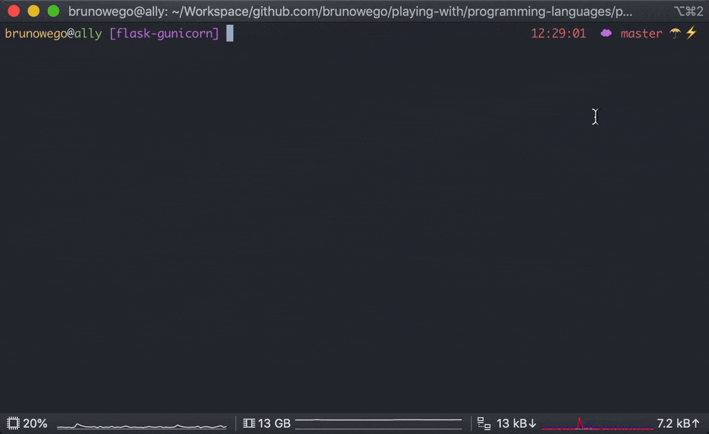

# Flask with Gunicorn

Gunicorn is a WSGI HTTP Server for UNIX and Flask a popular Microframework.



## Installation

### Clone Repository

```sh
git clone https://github.com/brunowego/playing-with.git playing-with && cd "$_"
```

```sh
cd ./programming-languages/python/flask-gunicorn
```

## Running

### Local Environment

#### Install Dependencies

```sh
make dev/install
```

#### Start

```sh
make dev/run
```

#### Test Endpoints

```sh
make dev/status
```

```sh
curl 'http://127.0.0.1:5000/'
curl 'http://127.0.0.1:5000/members'
curl -L "http://127.0.0.1:5000/members/$USER"
```

#### Stop

```sh
make dev/stop
```

#### Remove

```sh
make dev/remove
```

### With Docker

#### Build Image

```sh
make docker/build
```

#### Start

```sh
make docker/run
```

#### Test Endpoints

```sh
make docker/status
```

```sh
curl 'http://127.0.0.1:5000/'
curl 'http://127.0.0.1:5000/members'
curl -L "http://127.0.0.1:5000/members/$USER"
```

#### Remove

```sh
make docker/remove
```
