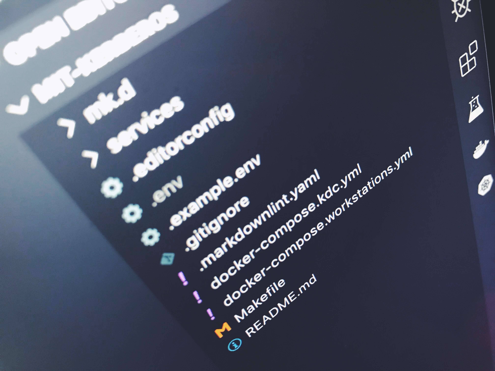

# MIT Kerberos



## Installation

### Clone Repository

```sh
git clone https://github.com/brunowego/playing-with.git playing-with && cd "$_"
```

```sh
cd ./security/authentication/mit-kerberos
```

### Boot Compose

```sh
make compose/up
```

```sh
make compose/status
```

## Workstations

### Using Password

#### List

```sh
docker-compose \
  -f ./docker-compose.workstations.yml \
  -f ./docker-compose.kdc.yml \
  exec through-password klist
```

#### Init

```sh
docker-compose \
  -f ./docker-compose.workstations.yml \
  -f ./docker-compose.kdc.yml \
  exec through-password /bin/sh -c 'echo "peniac" | kinit eniac'
```

#### Auth Admin

```sh
docker-compose \
  -f ./docker-compose.workstations.yml \
  -f ./docker-compose.kdc.yml \
  exec through-password kadmin -p eniac
```

> When ask for password, type: `peniac`

#### Destroy

```sh
docker-compose \
  -f ./docker-compose.workstations.yml \
  -f ./docker-compose.kdc.yml \
  exec -T through-password kdestroy
```

### Using PAM

#### List

```sh
docker-compose \
  -f ./docker-compose.workstations.yml \
  -f ./docker-compose.kdc.yml \
  exec through-pam klist
```

#### Init

```sh
docker-compose \
  -f ./docker-compose.workstations.yml \
  -f ./docker-compose.kdc.yml \
  exec through-password /bin/sh -c 'echo "peniac" | kinit eniac'
```

```sh
docker-compose \
  -f ./docker-compose.workstations.yml \
  -f ./docker-compose.kdc.yml \
  exec -u eniac through-pam /bin/bash -c 'su - johndoe'
```

> When ask for password, type: `pjohndoe`

#### Auth Admin

```sh
docker-compose \
  -f ./docker-compose.workstations.yml \
  -f ./docker-compose.kdc.yml \
  exec through-pam kadmin -p johndoe
```

> When ask for password, type: `pjohndoe`

### Using Keytab

#### Build Example

```sh
cat << EOF | docker build $(echo $DOCKER_BUILD_OPTS) -t example/workstation:latest -
FROM centos:7

RUN yum -y install krb5-workstation openssh-clients

RUN sed -i 's/^ default_ccache_name/# default_ccache_name/' /etc/krb5.conf

EOF
```

#### Workstation

##### Running

```sh
docker run -it --rm \
  $(echo $DOCKER_RUN_OPTS) \
  -h workstation \
  -v $PWD/services/through-keytab/krb5.conf.d:/etc/krb5.conf.d \
  -v $PWD/services/through-keytab/keytabs:/etc/security/keytabs \
  --name workstation \
  --net workbench \
  example/workstation:latest /bin/bash
```

##### Keytab

```sh
# list current cached credentials
klist

# show keytab data
klist -etk /etc/security/keytabs/eniac.keytab

# init keytab
kinit -kt /etc/security/keytabs/eniac.keytab workstation/through-keytab@EXAMPLE.COM

# login on through-keytab container through ssh
ssh \
  -o UserKnownHostsFile=/dev/null \
  -o StrictHostKeyChecking=no \
  eniac@through-keytab
```

##### Remove

```sh
docker rm -f workstation
docker rmi example/workstation:latest
```

## Shutdown

```sh
make compose/down
```
